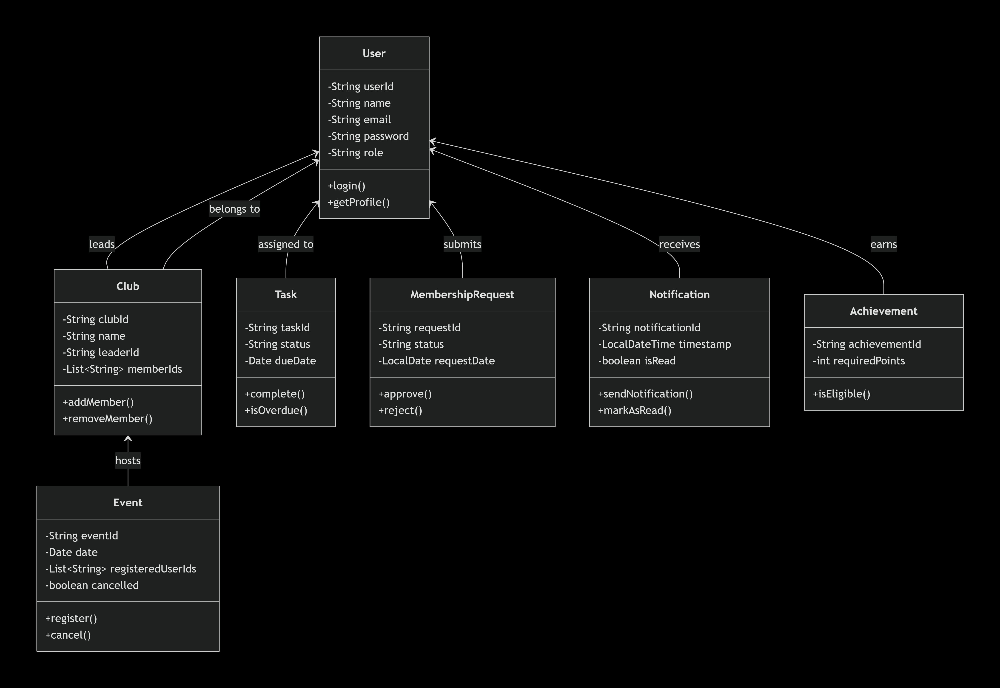

# Club Management System

> Developed by **Ahmed Medhat - Lojain Mohammed - Sereen Diab - Bassant Eid - Sama Ibrahim**

---
## Project Overview
The **Club Management System** is a desktop application built with Java and GUI technologies to streamline club operations in an organized and user-friendly way. It enables administrators and members to manage club activities such as event scheduling, task assignment, membership requests, notifications, and achievements tracking.

The project follows object-oriented programming principles with modular classes representing core entities like users, clubs, events, and tasks. It is ideal as an academic project demonstrating Java fundamentals, GUI development, system design, and practical management workflows.

**Developed by:** Lojain Mohammed - Sereen Diab
**Project Type:** GUI Desktop Application
**License:** Proprietary – All rights reserved

<div align="center">
  
</div>

---
## Project Structure
### CLUB-MANAGEMENT-SYSTEM (Java + GUI)
```js
club-management-system/
├── bin/
│   ├── Achievment.class
│   ├── Club.class
│   ├── Event.class
│   ├── Main.class
│   ├── MembershipRequest.class
│   ├── Notification.class
│   ├── Task.class
│   └── User.class
├── src/
│   ├── Achievment.java
│   ├── Club.java
│   ├── Event.java
│   ├── LoginFrame.java
│   ├── Main.java
│   ├── MainFrame.java
│   ├── MembershipRequest.java
│   ├── Notification.java
│   ├── Task.java
│   └── User.java
└── README.md
```

---
## Technologies Used
### Java
| Technology | Purpose | Version |
|------------|---------|---------|
|  | Core Backend Language | 17 |

---
## Installation

### Prerequisites
**Install Java Development Kit (JDK) 17 or higher**
```bash
java --version
javac --version
```

---
## License
**PROPRIETARY LICENSE**
© 2026 Ahmed Medhat - Lojain Mohammed. All Rights Reserved.
This project is a personal, non-commercial work created solely for the purpose of demonstrating full-stack web development skills.

This software and associated documentation are proprietary and confidential. No part of this project may be reproduced, distributed, or transmitted in any form without prior written permission from the author.

---
## Author
* **Ahmed Medhat**